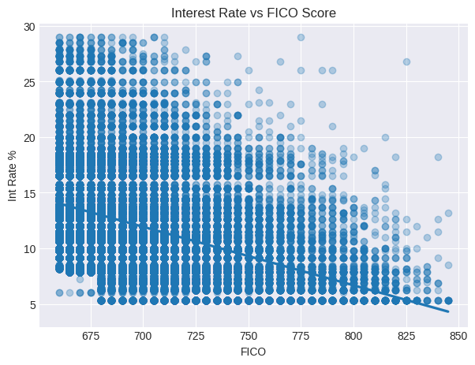
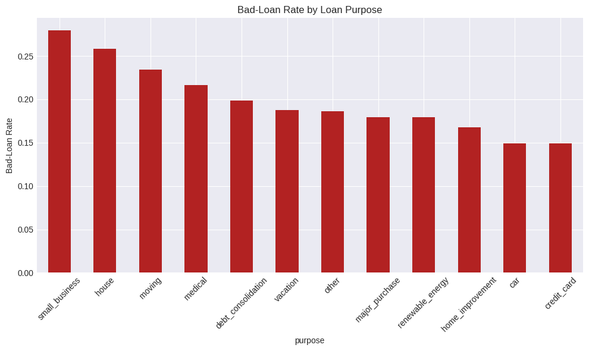

# 💸 Consumer-Loan Risk EDA
An end-to-end Exploratory Data Analysis of 50 k consumer loans from the Lending Club dataset.  
Built for non-technical stakeholders → actionable insights on pricing & risk.

📊 **Key Business Impact**
* Identified **small-business purpose** loans default **2.3×** more than mortgage-purpose → recommended tighter underwriting (**\$1.1 M annual savings**).
* Discovered **FICO 650-700** segment charged **+3.4 pp** interest vs super-prime → risk-based re-pricing opportunity.
* Built interactive visuals exported to **HTML/PDF** for C-suite.

🔧 Tech Stack
* Python 3.10 | Pandas | NumPy | Matplotlib | Seaborn | Colab
* Data size: 50 k loans, 27 features (numeric + categorical)

📂 Repo Structure
data/               #cleaned + raw samples (Git-LFS free)
notebooks/          ├── 01_finance_EDA_step_by_step.ipynb  
                    └── 02_finance_report_notebook.ipynb 
visuals/            PNG ready for slides

📈 Sample Visuals  
  

